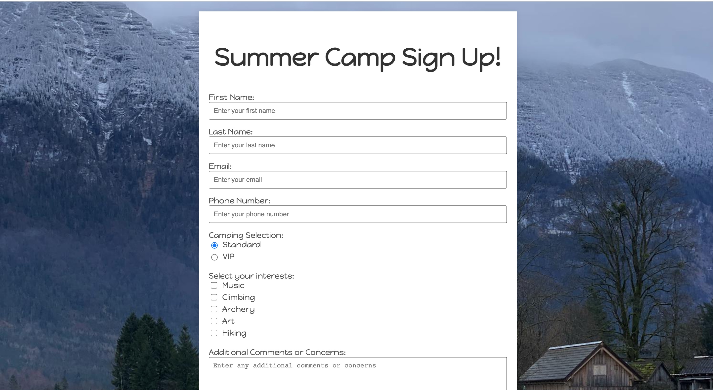

### Summer Camp Sign Up Site
## About
This project demonstrates a simple, yet effective form for signing up for an overnight camping experience. It uses HTML and CSS to create a responsive and user-friendly interface.

## Screenshot



## Technologies Used

- HTML
- CSS

## Features
- Text Inputs: Collects user information including name and contact details.
- Radio Buttons: Allows users to select their preferred camping package.
- Checkboxes: Users can choose additional activities.
- Email Input: Ensures the collection of valid email addresses.
- Telephone Input: Collects phone numbers.
- Textarea: Provides space for additional comments or requests.
- Dropdown Menu: Users can select their camping duration.
- Responsive Design: Ensures the form is accessible on various devices.

## Setup Instructions

1. Clone the repository:

   ```bash
   git clone https://github.com/samantha-sutter/camp-form

   ```

Navigate to the project directory and open index.html in your web browser to view the website.

## Live Demo

View the live demo of the website [here](https://slsutter.soisweb.uwm.edu/assignment-2-camp/).
